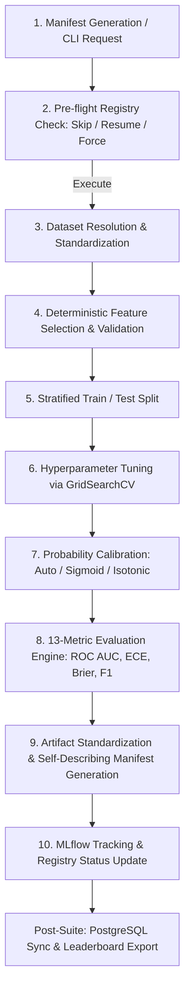
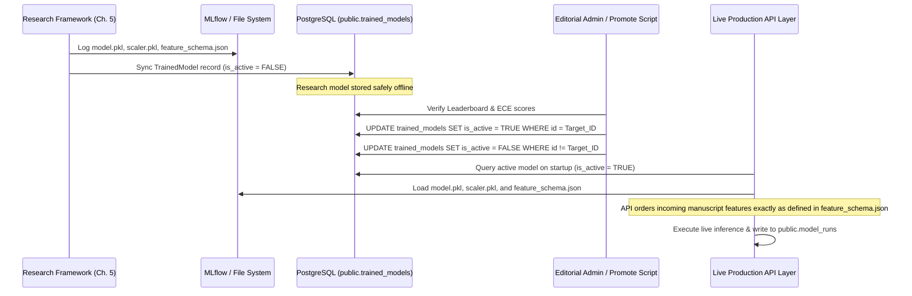

# Chapter 5 Experimentation Framework — Architectural Specification

This document details the architectural design, execution lifecycle, module responsibilities, and deployment contracts of the **Chapter 5 Experimentation Framework** for the Bachelor's Thesis (TFG): *An Editorial Pre-filter System for Scientific Manuscripts Using Classical Machine Learning and Large Language Models*.

---

## 1. Architectural Principles & Production Isolation

The experimentation framework is engineered under strict architectural contracts designed to ensure scientific rigor while maintaining absolute isolation from the live editorial decision-support system:

1. **Academic & Research Isolation**: The `experiments/` directory is an independent research framework dedicated exclusively to offline model evaluation, feature ablation studies (Experiments A–D), probability calibration analysis, and statistical hypothesis testing.
2. **Zero Production Mutation**: The framework NEVER modifies production packages (`packages/`), application servers (`apps/`), live API endpoints, or the production database schema.
3. **Database Contract**:
   - **READ-ONLY**: `public.models` and `public.prompt_templates` are accessed purely as read-only lookup tables to enrich MLflow tracking runs with active LLM model parameters and prompt descriptions.
   - **WRITE-ONLY**: Synchronized research models and run metadata are persisted exclusively into `public.experiments` and `public.trained_models`.
   - **RESTRICTED**: The framework NEVER writes to `public.model_runs`, which is strictly reserved for live production inference records generated by the API layer.
4. **Scientific Protocol Ownership**: All methodology definitions—including Feature Ablation Tiers (Exp A–D), dataset mappings, hyperparameter search grids, and calibration strategies—are owned by `experiments/config.py` and `experiments/models/common/feature_selector.py`. They represent academic protocol, not business configuration, and are deliberately excluded from database configuration tables.

---

## 2. Folder Structure & Module Responsibilities

```text
experiments/
├── README.md                           # Framework overview and execution guide
├── config.py                           # Scientific protocol: grids, datasets, tiers, protocols
├── experiment_manifest.py              # Single source of truth: deterministic ExperimentConfig IDs
├── results_registry.py                 # JSON-backed skip/resume/force run registry
├── experiment_summary.py               # Aggregates suite statistics into experiment_summary.json
├── leaderboard.py                      # Generates official ranking CSV sorted by thesis criteria
├── reproducibility.py                  # Collects OS, Python, git commit, seed, and lib versions
├── run_all_tfg_experiments.py          # Master manifest-driven execution engine
├── sync_mlflow_to_postgres.py          # Read-only lookup + Write-only research DB sync
├── results_exporter.py                 # Organizes publication figures & exports Excel/MD tables
│
├── baselines/
│   ├── README.md
│   └── run_classical_baselines.py      # TF-IDF + Classical ML baseline implementations
│
├── evaluation/                         # Statistical suites & comparative plotting
│   ├── compare_models.py               # Cross-classifier performance comparisons
│   ├── compare_feature_sets.py         # Ablation tier analysis (Exp A vs B vs C vs D)
│   ├── compare_prompts.py              # Prompt template version comparisons
│   ├── compare_llms.py                 # LLM backbone architecture comparisons
│   ├── statistical_tests.py            # McNemar, DeLong, Wilcoxon signed-rank tests
│   └── generate_figures.py             # Publication-ready comparative visualization generator
│
├── logs/                               # Per-experiment file logs (<experiment_id>.log)
│
├── models/
│   ├── common/                         # Reusable core infrastructure
│   │   ├── artifact_manager.py         # Standardized serialization & publication figure generator
│   │   ├── calibration.py              # Probability calibration (Sigmoid/Platt, Isotonic)
│   │   ├── constants.py                # Single source of truth for metric/artifact names
│   │   ├── dataset_loader.py           # Robust dataset resolution & target standardization
│   │   ├── db_metadata.py              # Read-only DB lookup for MLflow tag enrichment
│   │   ├── feature_selector.py         # Deterministic feature selection & ablation tier definitions
│   │   ├── metrics.py                  # 13-metric evaluation engine (including ECE & Brier)
│   │   ├── mlflow_logger.py            # MLflow experiment tracking encapsulation
│   │   ├── model_manifest.py           # Self-describing JSON generator (schema/metadata/metrics)
│   │   ├── utils.py                    # Seed setting, git hash, timing, and logging helpers
│   │   └── validators.py               # Pre-flight data integrity and NaN checks
│   ├── logistic_regression/train.py    # LR pipeline with StandardScaler & GridSearchCV
│   ├── random_forest/train.py          # Random Forest GridSearchCV training pipeline
│   └── xgboost/train.py                # XGBoost GridSearchCV training pipeline
│
└── results/                            # Official thesis reporting suite
    ├── experiment_summary.json         # Aggregate execution and top model metrics
    ├── leaderboard.csv                 # Official ranking sorted by ROC AUC, F1, ECE, MCC
    ├── reproducibility.json            # Full system environment and seed audit
    ├── comparison_tables.xlsx          # Multi-sheet Excel workbook for thesis tables
    ├── comparison_tables.md            # Markdown summary tables for documentation
    ├── registry.json                   # Execution state tracker for resume/skip logic
    └── publication_figures/            # Organized publication plots (ROC, PR, Calib, SHAP)
```

---

## 3. Experiment Execution Lifecycle

When an experiment is triggered (via `run_all_tfg_experiments.py` or individual train scripts), it undergoes a strict 10-stage lifecycle:



1. **Manifest Generation**: The runner iterates over `ExperimentConfig` objects generated by `experiment_manifest.py`, producing a deterministic ID: `Exp{Tier}_{Classifier}_{Calib}_{Dataset}_{Seed}`.
2. **Registry Check**: `results_registry.py` is queried. If the experiment previously completed with status `SUCCESS` and `--force` is not set, execution is skipped. In `--resume` mode, only missing or `FAILED` runs are executed.
3. **Dataset Loading**: `dataset_loader.py` resolves the dataset variant across standard project directories, maps target labels to clean `0/1` integers, and performs median/mode imputation.
4. **Feature Selection**: `feature_selector.py` extracts the subset of features corresponding to the requested Ablation Tier (A, B, C, or D). Crucially, features are sorted into a **deterministic canonical order**.
5. **Data Splitting**: A reproducible, stratified 80/20 train/test split is performed using the global random seed (`42`).
6. **Model Training**: `GridSearchCV` explores the hyperparameter space defined in `config.py` using 5-fold cross-validation optimized for `roc_auc`.
7. **Probability Calibration**: `calibration.py` fits a calibrated classifier (Sigmoid or Isotonic Regression) using cross-validation to ensure reliable confidence scores.
8. **Metric Computation**: `metrics.py` calculates 13 comprehensive evaluation metrics, including Expected Calibration Error (ECE) across 10 probability bins and Brier Score.
9. **Artifact Generation**: `artifact_manager.py` persists serialized models (`model.pkl`, `scaler.pkl`, `calibration.pkl`), exports test predictions and feature importances, renders 8+ publication figures (300 DPI), and invokes `model_manifest.py`.
10. **Tracking & Registration**: Metrics, parameters, tags (enriched via read-only DB queries), and artifacts are logged to MLflow. The local JSON registry is updated to record `SUCCESS`.

---

## 4. Self-Describing Model Manifest System

To eliminate external configuration dependencies and ensure auditability, every trained model directory automatically generates three JSON manifest files:

### `feature_schema.json`
Guarantees feature vector alignment between offline training and production inference by explicitly defining the exact column names and canonical order:
```json
{
  "feature_set": "C",
  "feature_set_version": "1.0",
  "ordered_features": [
    "pages", "total_rules_failed", "abstract_clarity", "structural_completeness"
  ],
  "number_of_features": 18,
  "target_column": "ground_truth"
}
```

### `metadata.json`
Captures complete lineage, audit trails, and execution context:
```json
{
  "experiment_id": "ExpC_RF_auto_dataset_42",
  "classifier": "Random Forest",
  "dataset": "dataset",
  "feature_set": "C",
  "feature_set_version": "1.0",
  "calibration_method": "auto",
  "prompt_version": "v5",
  "llm_model": "qwen3:4b",
  "random_seed": 42,
  "git_commit": "a3f2d91",
  "mlflow_run_id": "8f3a1b2c4d...",
  "timestamp": "2026-07-08T03:15:00Z",
  "training_time": 2341.2,
  "inference_time": 12.4,
  "scaler_present": false
}
```

### `metrics.json`
Provides an immutable record of all 13 evaluation metrics:
```json
{
  "accuracy": 0.8731,
  "precision": 0.8900,
  "recall": 0.8200,
  "f1": 0.8535,
  "roc_auc": 0.9210,
  "pr_auc": 0.9015,
  "balanced_accuracy": 0.8731,
  "mcc": 0.7421,
  "brier_score": 0.0921,
  "ece": 0.0312,
  "training_time_ms": 2341.2,
  "inference_time_ms": 12.4
}
```

---

## 5. MLflow & PostgreSQL Synchronization

MLflow serves as the primary tracking engine during experimentation. Upon completion of an experiment suite, `sync_mlflow_to_postgres.py` bridges offline research and relational storage:

1. **Model Registry Lookup**: Queries `public.models` (read-only) to match the classifier name and resolve its foreign key ID.
2. **Experiment Record Creation**: Writes a summary record into `public.experiments` capturing dataset, tier, calibration, and aggregate metrics.
3. **TrainedModel Persistence**: Inserts a record into `public.trained_models` containing the MLflow run ID, local artifact URIs, and full metric JSONs.
4. **Safety Lock (`is_active = FALSE`)**: To prevent experimental research models from accidentally serving live traffic, all synced records are explicitly written with `is_active = FALSE`.

---

## 6. Research-to-Production Promotion Workflow

How a trained research model from Chapter 5 is promoted into the live production editorial decision-support pipeline:



1. **Validation**: The editorial team reviews `leaderboard.csv` and `comparison_tables.xlsx` in `experiments/results/`, selecting the candidate with the highest ROC AUC and lowest ECE (typically **Tier C — Hybrid**).
2. **Promotion**: An administrator executes an SQL update (or promotion utility) to set `is_active = TRUE` on the target record in `public.trained_models` while deactivating previous models.
3. **Inference Initialization**: On startup, the production API service queries `public.trained_models` for the active model record and loads `model.pkl`, `scaler.pkl` (if applicable), and `feature_schema.json` from the artifact URI.
4. **Feature Alignment**: When evaluating a new manuscript, the production pipeline extracts raw features and uses `feature_schema.json` (`ordered_features`) to construct the exact feature vector expected by the model, eliminating feature drift.
5. **Live Decision Support**: Calibrated acceptance probabilities and SHAP explanations are returned to the editor, and the live transaction is logged to `public.model_runs`.
